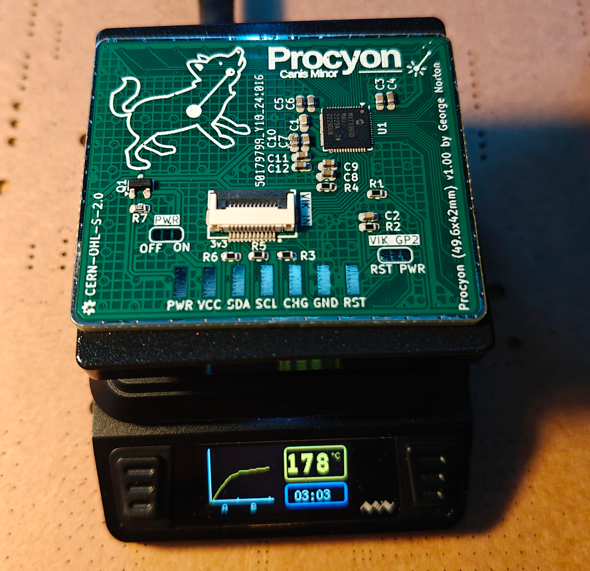

# Procyon

Procyon is an experimental trackpad similar to, but different from Peacock. The PCBs themselves are small and I
intend to add more sizes over time. Unlike Peacock, these are not standalone devices, they are intended to be
built into QMK/ZMK keyboards.

## Differences from Peacock

- Removed the separate LDO for AVCC - it all runs of the VIK 3.3v line which is preferable for wireless builds.
- Added a MOSFET to allow cutting power to the module, again this is a power saving feature for ZMK.
- The PCB is 4-layers with all the components mounted on the reverse of the sensor.
- The size was picked to fit the Dilemma in place of the 40mm Cirque.

## Naming

Like Peacock, Procyon is named after a navigational star.

## Assembly

Procyon can be assembled by JLCPCB, or your favorite factory. Alternatively, if you feel brave, the components are not
too tiny (0603) so it can be assembled on a small hotplate (such as the MHP50), you will probably need a stencil, and
paste suitable for narrow apertures.