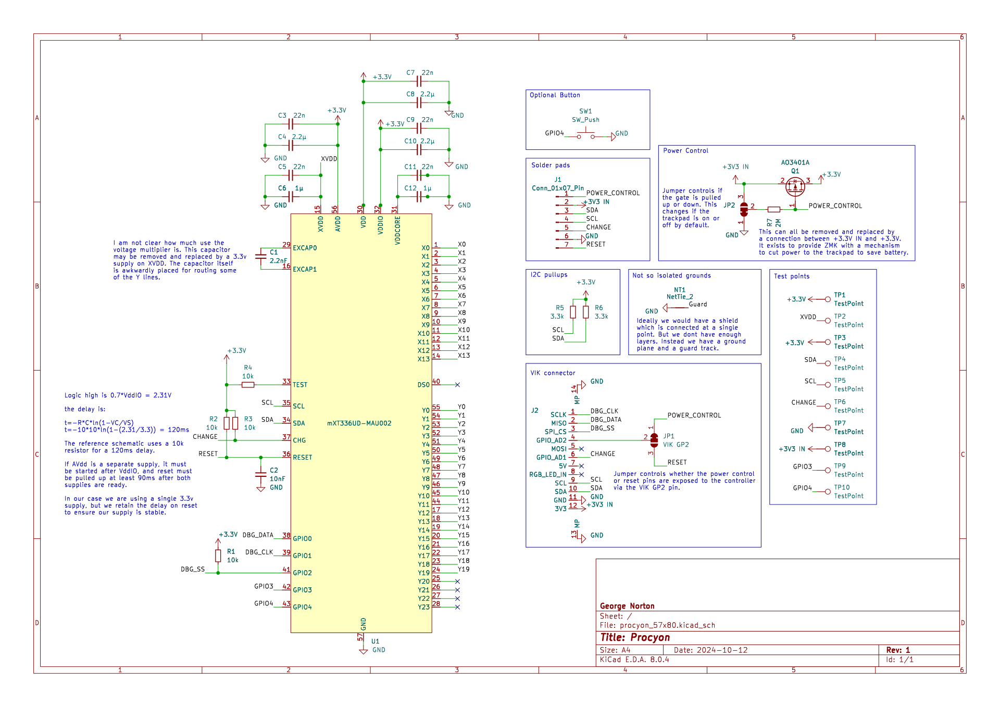

# Procyon

Procyon is an experimental trackpad similar to, but different from [Peacock](https://github.com/george-norton/peacock).
The PCBs themselves are small and I intend to add more sizes over time. Unlike Peacock, these are not standalone devices, they are intended to be
built into QMK/ZMK keyboards.

## Differences from Peacock

- Removed the separate LDO for AVCC - it all runs of the VIK 3.3v line which is preferable for wireless builds.
- Added a MOSFET to allow cutting power to the module, again this is a power saving feature for ZMK.
- The PCB is 4-layers with all the components mounted on the reverse of the sensor.
- Far smaller sensor areas.
- No integrated controller - these are meant for integrating into your own builds.

## Sensor capabilities

The mXT336UD-MAU002 sensor IC used in this design is in fact a touchscreen controller rather than a trackpad controller. I have chose this controller for Peacock as I wanted something that could support a large trackpad, and I have reused it here so I can reuse the code I wrote for Peacock.
- Detect 10 concurrent touch events.
- Can support both mutual capacitance and self capacitance measurements.
- Has integrated signal processing capabilities to reduce noise, reject large touches (grip or palms) etc..
- Can be configured as a digitizer, or an array of up to 16 buttons.
- The sensor also supports a passive stylus, the trackpads themselves are a litle small - but it works.

## Naming

Like Peacock, Procyon is named after a navigational star.

## Assembly

Procyon can be assembled by JLCPCB, or your favorite factory. Alternatively, if you feel brave, the components are not too tiny (0603) so it can be assembled on a small hotplate (such as the MHP50), you will probably need a stencil, and paste suitable for narrow apertures. The component placement (other than the optional button) is common between boards, so the same stencil can be reused.

The 57x80 variant has an optional footprint for a button. This button is wired to a GPIO on the MaxTouch IC and is accessable through the MaxTouch GPIO interface.

## Surfaces

A surface is required for the sensor to function. This should be an insulator, it should also feel nice since you will be touching it a lot. It is a good idea to fix the sensor to the board with glue or double sided tape. Good surface materials include:
- Vinyl
- PLA (printed at 0.5-1.6mm thickness - 100% infil)
- Acrylic (will need tuning tweaks if its thick)

## Wiring it up

- The easiest way to wire up a Procyon is via the [VIK](https://github.com/sadekbaroudi/vik) interface. Usually this requires a 12P 0.5mm pitch type A FFC cable. But For the Dilemma and SplitKB Halycon boards, you will need a type B cable instead.
- Alternatively you can solder wires to the pads on the board. You will need a minimum of VCC (3.3v), GND, SDA, SCL and CHG (connect to any GPIO pin).

## Software support

Currently there are experimental QMK and ZMK branches with Procyon support.

The [QMK multitouch_experiment branch](https://github.com/george-norton/qmk_firmware/tree/multitouch_experiment) exteneds the QMK digitizer feature to implement real trackpad support. On this branch, the MaxTouch driver reports 5 separate finger positions to the host and it detects gestures. You should get all the same gesture support you would expect from a modern trackpad. This branch is a large changeset which will likely take some time to get merged into QMK. There are some [pre-built QMK firmware images in my userspace](https://github.com/george-norton/qmk_userspace/releases/tag/latest).

The [ZMK Maxtouch module](https://github.com/george-norton/maxtouch-zephyr-module) builds against Petes [feat/pointers-move-scroll-ptp](https://github.com/petejohanson/zmk/tree/feat/pointers-move-scroll-ptp) ZMK branch. It is currently missing the ability to fallback to mouse emulation (so no MacOS support).

## Sensor tuning

The sensor sensitivity may require tuning depending on the type of surface you use on your build. This can be done by adjusting the touch threshold, and
if required the transmit gain. If your sensor is not detecting touches well, reduce the touch threshold. If your sensor is jittery, or is detecting spurious touches increase the touch threshold, or if there is any ungrounded metal by the sensor, move it. Increasing the transmit gain will require a larger touch threshold, but it should enable you to use thicker overlays and it will give you more room to adjust the touch threshold.

The mouse emulation gestures are implemented in software, they rely on various parameters that can be tuned by defining macros.

If you flash the QMK debug firmware, you can use the [Maxtouch debug](https://github.com/george-norton/maxtouch-debug) tool to adjust the sensor tuning in real time and see how it works.

## VIK certification

| Category                | Classification          | Response           |
| ----------------------- | ----------------------- | ------------------ |
| FPC connector           | Required                | :heavy_check_mark: |
| Breakout pins           | Recommended             | :x:                |
| Uses: SPI               | Optional                | :heavy_check_mark: |
| SPI used for SPI only   | Strongly recommended    | :heavy_check_mark: |
| Uses: I2C               | Optional                | :heavy_check_mark: |
| I2C used for I2C only   | Strongly Recommended    | :heavy_check_mark: |
| I2C pull ups            | Required                | 3.3k               |
| Uses: RGB               | Optional                | :x:                |
| Uses: Extra GPIO 1      | Optional                | :heavy_check_mark: |
| Uses: Extra GPIO 2      | Optional                | :heavy_check_mark: |
| Standard PCB Size/Mount | Strongly recommended    | :x:                |

## Schematic

